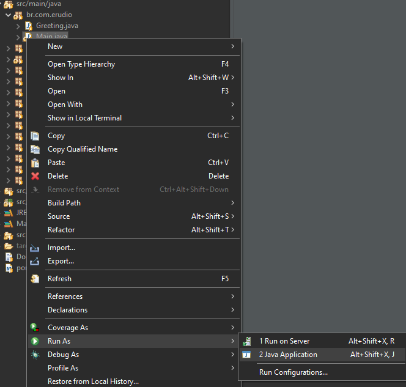

# Spring Boot 2.1.3
## Desafio NATI


Desenvolver uma aplicação web responsável por montar a matriz curricular
de um curso. O sistema deve mostrar a visão do administrador, coordenador e aluno

### Ferramentas

<br/>

<p align="left">

  <a href="https://www.docker.com/" target="_blank">
    
  </a>
  
  <a href="https://www.eclipse.org/downloads/" target="_blank">
    
  </a>

  <a href="https://www.postgresql.org" target="_blank">
    
  </a>
  
   <a href="https://spring.io/projects/spring-boot" target="_blank">
    
  </a>
  
   <a href="https://www.oracle.com/java/technologies/javase-jdk11-downloads.html" target="_blank">
    
  </a>
</p>


## Conteúdo:
   * Implementação de DTO'S
   * Versionamento de API
   * Migração com Flyway
   * Implementação de Hateoas para paginação
   * Suporte a Swagger para documentação
   * Integração com docker-compose

## Requisitos para ambiente de desenvolvimento
* Java 11
* Apache Maven 3.6.3
* Postgres
* Eclipse (20-09)

## Instalação:

Para executar no eclipse é necessario ajustar o arquivo do banco de dos presente no diretorio ```src/main/resources/application.properties```, altere as seguintes variaveis: URL_DB, USER_DB ,PASSWORD_DB.

```sh
spring.datasource.url= jdbc:postgresql://URL_DB:PORT_DB/NAME_DB
spring.datasource.username=USER_DB
spring.datasource.password=PASSWORD_DB
```
Tambem é necessario alterar as credenciais no Flyway presente no arquivo pom.xml:

```sh

<configuration>
  <url>jdbc:postgresql://URL_DB:PORT_DB/NAME_DB?useTimezone=true&amp;serverTimezone=UTC&amp;useSSL=false</url>
  <user>USER_DB</user>
  <password>PASSWORD_DB</password>
</configuration>
```
O projeto usa a biblioteca lombok para gerar os getters e setters. Para que o eclipse reconheça localmente é necessario instalar um jar presente nesta URL: 

```https://projectlombok.org/downloads/lombok.jar```

Agora execute o Main.java como mostra a imagem abaixo:




## Requisitos do ambiente de produção
* Java 11
* Apache Maven 3.6.3
* Docker-Compose

## Instalação do ambiente de produção
Acesse o diretorio  ```docker-compose.yml``` e execute o comando ```sudo docker-compose up```

## FrontEnd
O frontend não está alocado em nenhum servidor. Basta abrir as paginas em html. O backend roda na porta 8081. Se for necessario trocar a porta do frontend basta abrir o arquivo ajax.js e alterar a variavel host.

## Swagger

Também é possivel testar as requisições a partir da documentação gerada pelo swagger basta acessar a seguinte url:
```http://localhost:8081/swagger-ui.html```

## Meta

Ronaldo Almeida – [Linkedin](https://www.linkedin.com/in/ronaldo-almeida-9a8a8316b/) – ronaldoalm1812@edu.unifor.br

[https://github.com/ronaldoalm](https://github.com/ronaldoalm)
